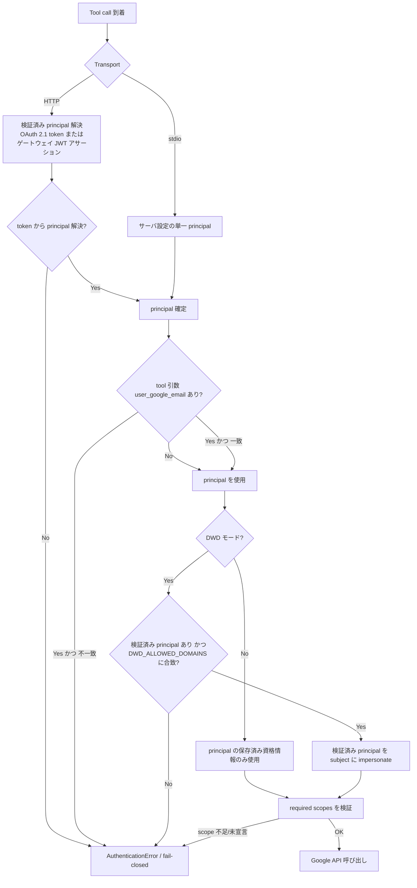
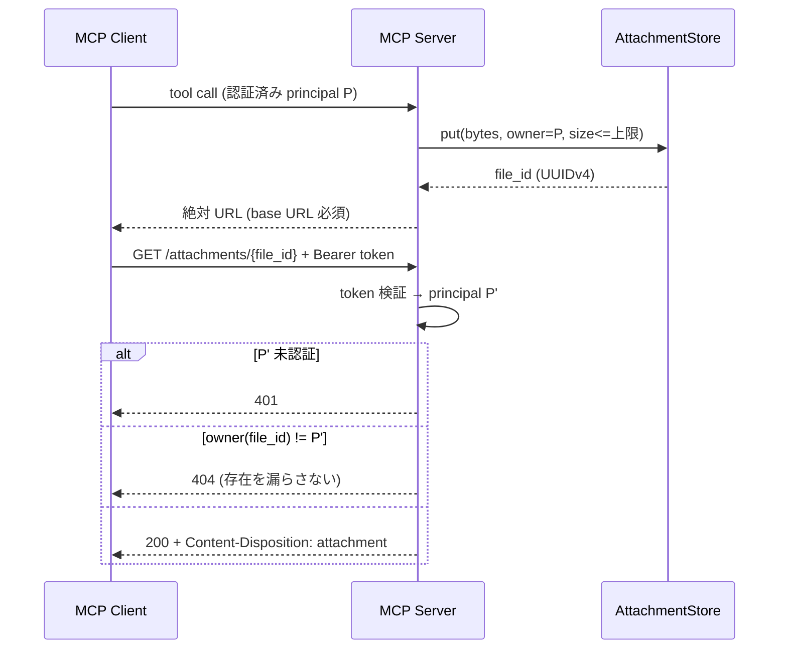
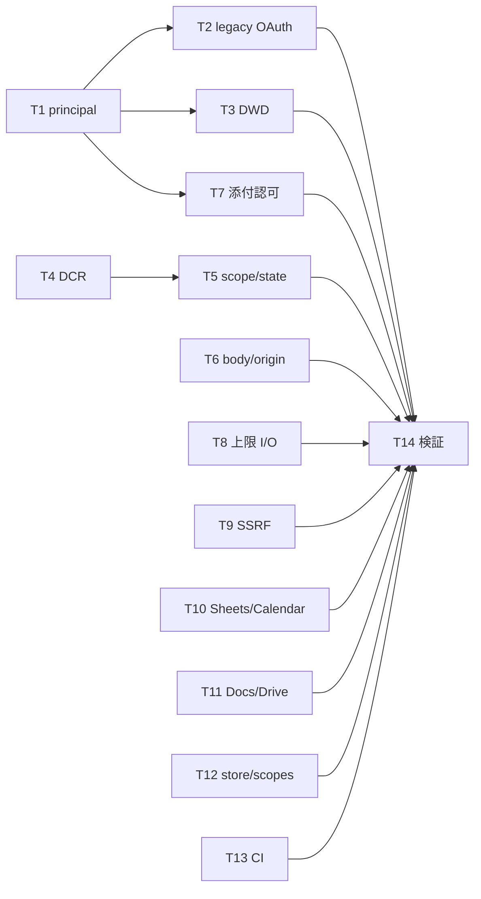

# 脆弱性修正計画 (Vulnerability Remediation Plan)

- 対象リポジトリ: `soramash/google_workspace_mcp`
- 診断レポート: [`docs/vuln/mash google workspace MCP.md`](../vuln/mash%20google%20workspace%20MCP.md)
- 診断対象コミット: `984f06387f17c8afae8569239f60cb87efdf50df`
- 対象指摘件数: **51 件すべて**
- 本文書の位置づけ: 実装前の承認済み修正方針。実装は本文書のタスク単位で行う。
- 実装状況: T1–T14 完了。運用者向けの移行手順は
  [`hardening-migration.md`](hardening-migration.md) を参照。実装中に本計画から精緻化した
  点は第 9 章に記録している。

---

## 1. Problem Statement

静的解析により 51 件の指摘が報告された。分類は 重大 5 件 / 高 17 件 / 中 17 件 / 低 3 件 / その他 9 件（合計 51 件）。個別に読むと 51 件だが、実際のコード上の欠陥は次の 12 の根本原因に収束する。

1. **呼び出し元が申告した `user_google_email` を認証済み主体として信頼している**（stdio / legacy OAuth 2.0 / DWD の三経路で重複指摘）
2. **Domain-Wide Delegation の subject が検証されていない**（許可リスト既定未設定 + caller 制御 subject）
3. **MCP セッション ID が再検証なしの認証フォールバックになっている**
4. **OAuth 2.1 DCR の redirect URI 許可リストが未設定時に fail-open する**
5. **OAuth state / scope の検証が単一ユーザーモードでフォールバック的に無効化される**
6. **添付ファイル配信エンドポイントに認証と所有者チェックがない**
7. **ダウンロード・アップロード経路にサイズ上限がなく、非ストリーミングでメモリに載せている**（Chat / Gmail / Drive / Docs / Apps Script）
8. **HTTP リクエストボディに上限がなく、Origin 検証が host 一致で緩い**
9. **SSRF 保護が `ipaddress.is_global` の実装差に依存し、cancellation でクライアントがリークする**
10. **スプレッドシート書き込みが既定で `USER_ENTERED`、Calendar が他参加者の RSVP を上書きできる**
11. **Docs/Drive の入力検証不足**（URL スキーム、非 BMP のインデックス、クエリインジェクション、MIME、パス存在オラクル）
12. **認証情報書き込みが非アトミック、スコープ未宣言ツールがフィルタを回避、CI が未検証の外部入力を実行**

したがって 51 件を 51 個の独立パッチとして扱わず、根本原因単位で修正し、**指摘番号 → タスクの対応表**（第 5 章）で網羅性を担保する。

## 2. Requirements

ユーザー承認済みの制約。

| # | 要件 | 決定 |
| :--- | :--- | :--- |
| R1 | 対象範囲 | 深刻度によらず **51 件すべて**を扱う |
| R2 | 互換性 | **破壊的変更を許容**する。安全側に倒すために起動失敗させることも可 |
| R3 | 優先環境 | **HTTP トランスポート + OAuth 2.1 マルチユーザー**を第一級とする。stdio / single-user は縮退構成として扱う |
| R4 | 危険機能 | 削除ではなく **既定無効 + 明示的オプトイン**（数式、DWD、legacy OAuth 2.0 など） |
| R5 | リソース上限 | 環境変数で可変にせず **固定値**をコードに埋め込む |
| R6 | 完了条件 | 各修正に**自動回帰テスト**を追加し、かつ**既存テスト全件が成功**すること |

### 非目標

- 認証アーキテクチャの全面再設計（FastMCP の認可プロバイダ差し替えなど）は行わない。
- Google API 側のクォータ・課金設計は扱わない。
- レポート未指摘の箇所に対する予防的リファクタリングは行わない。

## 3. Research Findings

実装方針の根拠として確認した公式仕様。

| 論点 | 結論 | 出典 |
| :--- | :--- | :--- |
| OAuth redirect URI は登録済み値と完全一致で検証すべき | 部分一致・prefix 一致は認可コード窃取に繋がる | [RFC 6749 §3.1.2, §10.6](https://www.rfc-editor.org/rfc/rfc6749) |
| DCR は誰でも `redirect_uris` を登録し得る | 許可リストなしの DCR は攻撃者に任意 URI 登録を許す | [RFC 7591](https://www.rfc-editor.org/rfc/rfc7591) |
| MCP サーバは token audience を検証し、セッション ID を認証に使ってはならない | セッション ID は認可の代替にならない | [MCP Authorization (2025-06-18)](https://modelcontextprotocol.io/specification/2025-06-18/basic/authorization) |
| `ipaddress.is_global` の分類はバージョン間で変化している | 3.10 の fc00::/7・CGNAT 誤判定に依存せず、**危険レンジを明示拒否**する必要がある。3.11 へ上げるだけでは不十分（3.10.15 / 3.13 でも分類修正が入っている） | [3.10 ipaddress](https://docs.python.org/3.10/library/ipaddress.html) / [current ipaddress](https://docs.python.org/3/library/ipaddress.html) |
| Docs API のインデックスは UTF-16 コードユニット単位 | 非 BMP 文字は 2 単位。`len(str)` ベースの計算は破綻する | [Docs API structure](https://developers.google.com/workspace/docs/api/concepts/structure) |
| `USER_ENTERED` は入力を UI 相当に解釈する。`RAW` は解釈しない | 既定を `RAW` にすれば数式インジェクションは成立しない | [ValueInputOption](https://developers.google.com/workspace/sheets/api/reference/rest/v4/ValueInputOption) |
| `events.update` は全フィールド置換のため attendees ごと上書きされる | 自分以外の `responseStatus` を送らないことが必須 | [events.update](https://developers.google.com/workspace/calendar/api/v3/reference/events/update) |
| Drive の検索クエリは文字列連結で構築され、`'` のエスケープが必要 | `folder_id` 等は許可文字検証＋エスケープが必要 | [Drive search files](https://developers.google.com/workspace/drive/api/guides/search-files) |

### 現行コードで確認した該当実装

- `auth/auth_info_middleware.py` — stdio 経路の `requested_user` 採用、`has_session()` による fallback、`mcp_session_binding`
- `auth/service_decorator.py` — `_user_email_is_managed` / `_validate_dwd_domain` / `_authenticate_service`、空スコープ時の fail-open
- `auth/google_auth.py::get_credentials` — セッション不一致後に credential store へフォールスルー
- `auth/oauth21_session_store.py` — `consume_latest_oauth_state` の単一ユーザーフォールバック、`get_user_by_mcp_session`、scope 未保存
- `core/server.py` — `_is_same_origin_as_host`、`_parse_allowed_redirect_uris`、`serve_attachment`、body 上限なし
- `core/attachment_storage.py` — owner 情報とサイズ上限なし
- `core/http_utils.py` — `is_global` 依存、`ssrf_safe_stream` の cancellation リーク
- `gchat/chat_tools.py::download_chat_attachment` — 上限なし非ストリーミング取得
- `gmail/gmail_tools.py` — path / Base64 添付上限なし、相対 attachment URL
- `gdrive/drive_tools.py`, `gdrive/drive_helpers.py` — Base64 / ローカルファイル上限、MIME 上書き
- `gdocs/docs_tools.py`, `gdocs/docs_markdown_writer.py` — `BytesIO` 全読み、URL スキーム、UTF-16 インデックス
- `gsheets/sheets_tools.py` — `USER_ENTERED` 既定、`_to_extended_value`
- `gcalendar/calendar_tools.py::_normalize_attendees`
- `gappsscript/apps_script_tools.py::_update_script_content_impl`
- `core/utils.py::validate_file_path`
- `core/tool_registry.py` — `_required_google_scopes` 未定義時の fail-open
- `auth/credential_store.py` — `O_TRUNC` による非アトミック書き込み
- `.github/workflows/publish-mcp-registry.yml` — 任意 `$schema` の取得、`releases/latest` の未検証実行

## 4. Target Design

### 4.1 認証・認可の原則

**Principal（操作主体）はトランスポート層の認証結果のみから決定する。ツール引数からは決定しない。**

`user_google_email` は今後「認証済み principal と一致するかを検証される対象」に格下げする。不一致は fail-closed（例外）とし、フォールバックしない。

要点:

- MCP セッション ID は**認証手段にしない**。トークン検証済みセッションに紐づく補助情報としてのみ使い、単独で principal を復元しない。
- legacy OAuth 2.0（credential store 直参照）は HTTP マルチユーザーで**既定無効**。有効化には明示フラグを要し、その場合も principal 一致検証を必須にする。
- DWD の subject は「検証済み principal」のみ。caller が渡した値は subject にしない。`DWD_ALLOWED_DOMAINS` 未設定なら DWD 自体を無効（起動時に失敗または機能停止）。
- ツールが `_required_google_scopes` を宣言していない場合は fail-closed（実行拒否）。

#### HTTP マルチユーザーにおける principal の供給元

現行実装では次の 2 モードが**相互排他**である（`auth/oauth_config.py`: `TRUST_GATEWAY_IDENTITY=true` と `MCP_ENABLE_OAUTH21=true` の同時指定は `ValueError`）。本計画はどちらのモードでも同一の fail-closed 規則を適用する。

| モード | 有効化 | principal の供給元 |
| :--- | :--- | :--- |
| OAuth 2.1（R3 の主対象） | `MCP_ENABLE_OAUTH21=true` | 検証済み access token |
| 信頼済みゲートウェイ | `TRUST_GATEWAY_IDENTITY=true`（OAuth 2.1 は off） | JWKS 検証済みゲートウェイ JWT アサーションの email |

どちらのモードでもない HTTP 構成は「検証済み principal を持たない」ため、マルチユーザーとして扱わず DWD を無効にする。

### 4.2 添付ファイル配信

- raw route は **Bearer 認証 + owner 一致**を既定とする。UUID の秘匿性に依存しない。
- レスポンス URL は必ず絶対 URL。相対 URL を返さない（信頼済みオリジン検証を迂回させない）。
- 認可失敗は 404 に統一して存在オラクルを作らない。

### 4.3 固定リソース上限（R5）

環境変数で変更できない定数として実装する。

| 対象 | 上限 |
| :--- | :--- |
| HTTP リクエストボディ | 50 MiB |
| Gmail 添付（デコード後、合計） | 25 MiB |
| Chat 添付 / インメモリ添付 | 50 MiB |
| Drive インライン Base64 | 32 MiB |
| Drive URL / ローカルファイル（ストリーミング） | 2 GiB |
| Docs コンテンツ抽出 | 50 MiB |
| Apps Script | 100 ファイル / 1 ファイル 5 MiB / 合計 10 MiB |

超過時は「途中まで読んでから判断」ではなく、**宣言サイズの事前チェック + ストリーミング中の累積バイト数チェック**の二段で早期中断する。`Content-Length` は信頼しない（欠落・虚偽を想定）。

### 4.4 SSRF

`is_global` の真偽に依存せず、拒否レンジを明示列挙する allowlist/denylist 判定に置き換える。

- 拒否: loopback, link-local (169.254/16, fe80::/10), private (10/8, 172.16/12, 192.168/16), CGNAT (100.64/10), ULA (fc00::/7), IPv4-mapped/embedded IPv6, multicast, reserved, unspecified, `::ffff:0:0/96` 経由の迂回
- リダイレクト先を**毎ホップ**再検証する
- 名前解決結果の全 A/AAAA を検証（DNS rebinding 対策として解決済み IP へ接続）
- `ssrf_safe_stream` は `try/finally` もしくは `contextlib.aclosing` 相当で、`asyncio.CancelledError` 発生時にも `AsyncClient` を確実に閉じる

## 5. 指摘番号 → タスク対応表

51 件すべてが下表のいずれかのタスクに割り当てられている。

| 指摘 | 深刻度 | 概要 | タスク |
| :---: | :---: | :--- | :---: |
| 1 | 重大 | Chat 添付ダウンロードのサイズ上限欠如 | T8 |
| 2 | 重大 | DWD 権限昇格（任意ドメインユーザーへのなりすまし） | T3 |
| 3 | 重大 | `save_attachment` のサイズ上限欠如による DoS | T7 |
| 4 | 重大 | SA モードの無制限 DWD なりすまし（垂直昇格） | T3 |
| 5 | 重大 | DWD ドメイン許可リスト既定未設定 | T3 |
| 6 | 高 | Python 3.10 の ULA (fc00::/7) SSRF バイパス | T9 |
| 7 | 高 | `is_global` バグによる CGNAT/予約アドレス SSRF | T9 |
| 8 | 高 | stdio の `user_google_email` なりすまし | T1 |
| 9 | 高 | Same-Origin-as-Host による DNS リバインディング | T6 |
| 10 | 高 | `append_table_rows` の数式インジェクション | T10 |
| 11 | 高 | `create_drive_file` の `file://` 無制限読み込み | T8 |
| 12 | 高 | `get_doc_content` の無制限インメモリ DL | T8 |
| 13 | 高 | `manage_event` update による他参加者 RSVP 改ざん | T10 |
| 14 | 高 | `modify_sheet_values` の `USER_ENTERED` 数式注入 | T10 |
| 15 | 高 | CI の未検証 `$schema` URL による SSRF | T13 |
| 16 | 高 | DWD の caller 制御 `user_google_email` による IDOR | T3 |
| 17 | 高 | SA DWD の `user_google_email` IDOR | T3 |
| 18 | 高 | SA モードの無制限 DWD による水平昇格 | T3 |
| 19 | 高 | HTTP ボディサイズ上限欠如による DoS | T6 |
| 20 | 高 | Gmail パスベース添付の上限欠如 | T8 |
| 21 | 高 | legacy OAuth 2.0 のクロスユーザー資格情報アクセス | T2 |
| 22 | 高 | legacy OAuth 2.0（service decorator）の IDOR | T2 |
| 23 | 中 | DCR 許可リスト未設定時の任意 redirect URI 登録 | T4 |
| 24 | 中 | `/attachments/{file_id}` の所有者確認欠如 | T7 |
| 25 | 中 | MCP セッション ID による認可バイパス | T1 |
| 26 | 中 | Markdown→Docs の `javascript:` スキームバイパス | T11 |
| 27 | 中 | 非 BMP 文字によるカーソルインデックス誤算 | T11 |
| 28 | 中 | DCR redirect URI 無制限受理（認可コード窃取） | T4 |
| 29 | 中 | セッションストアの scope 欠落によるスコープ制限バイパス | T5 |
| 30 | 中 | 未認証 IDOR による添付ファイル漏洩 | T7 |
| 31 | 中 | `list_docs_in_folder` の Drive クエリインジェクション | T11 |
| 32 | 中 | `update_script_content` のサイズ上限欠如 | T8 |
| 33 | 中 | DWD による任意ユーザーとしてのスクリプト実行 | T3 |
| 34 | 中 | ファイルパス検証のパス存在オラクル | T11 |
| 35 | 中 | legacy OAuth 2.0 の caller 制御 IDOR | T2 |
| 36 | 中 | legacy OAuth 2.0 のクロスユーザースクリプト実行 | T2 |
| 37 | 中 | legacy OAuth 2.0 資格情報アクセスの水平昇格 | T2 |
| 38 | 中 | 相対 URL による信頼済みオリジン検証バイパス | T7 |
| 39 | 中 | 未認証添付配信によるユーザー間クロスアクセス | T7 |
| 40 | 低 | `LocalDirectoryCredentialStore` の非アトミック書き込み | T12 |
| 41 | 低 | `_required_google_scopes` 未宣言ツールのフィルタ回避 | T12 |
| 42 | 低 | `create_drive_file` の MIME 上書き | T11 |
| 43 | その他 | BOLA: stdio 認証パスの caller 引数信頼 | T1 |
| 44 | その他 | `base64_content` のサイズ上限欠如 | T8 |
| 45 | その他 | `USER_ENTERED` 既定による stored formula injection | T10 |
| 46 | その他 | CI の未検証バイナリ実行（サプライチェーン） | T13 |
| 47 | その他 | OAuth state のセッションバインディング検証バイパス | T5 |
| 48 | その他 | `consume_latest_oauth_state` フォールバックによる state 検証無効化 | T5 |
| 49 | その他 | `ssrf_safe_stream` の `AsyncClient` リーク | T9 |
| 50 | その他 | Base64 添付の上限欠如 | T8 |
| 51 | その他 | 許可リスト未設定時の任意 redirect URI 受理 | T4 |

集計: T1=3, T2=5, T3=7, T4=3, T5=3, T6=2, T7=5, T8=7, T9=3, T10=4, T11=5, T12=2, T13=2 → **合計 51 件**。T14 は横断検証タスク。

---

## 6. 実装タスク

各タスクは Objective / Implementation guidance / Test requirements / Demo を持つ。T1 は認証系（T2, T3, T7）の前提なので最初に実施する。T6, T8–T13 は相互依存が薄く並行実施可能。T14 は最後に実施する（依存関係は第 8 章の図を参照）。

### T1. HTTP / stdio の principal を fail-closed 化

対象指摘: **8, 25, 43**

**Objective**
ツール引数 `user_google_email` と MCP セッション ID ヘッダーが principal 決定に使われる経路を排除し、トランスポート認証結果を単一の真実にする。

**Implementation guidance**
- `auth/auth_info_middleware.py`
  - stdio: principal はサーバ設定（`USER_GOOGLE_EMAIL` 等）で固定。`requested_user` を principal に採用するコードパスを削除。
  - HTTP: OAuth 2.1 トークン検証結果からのみ principal を解決。`has_session()` による「セッションが存在するから認証済みとみなす」フォールバックを削除。
  - `mcp_session_binding` は、既にトークン検証済みのセッションに対する補助参照のみ。単独で principal を返さない。
- 引数と principal の不一致は例外（fail-closed）。「引数を優先」「store にあれば通す」といった緩和は入れない。
- `auth/oauth21_session_store.py::get_user_by_mcp_session` の呼び出し元を見直し、認証判断に使っている箇所を除去。

**Test requirements**（`tests/auth/test_auth_info_middleware.py` を拡張）
- stdio: 設定 principal と異なる `user_google_email` を渡すと拒否される
- HTTP: トークンなし + 既存セッション ID のみでは拒否される
- HTTP: 有効トークンの principal と一致する引数は許可される
- HTTP: 有効トークンの principal と異なる引数は拒否される

**Demo**
`user_google_email` に他ユーザーを指定したツール呼び出しが、stdio・HTTP 双方で認証エラーになるログを提示する。

---

### T2. legacy OAuth 2.0 経路の隔離

対象指摘: **21, 22, 35, 36, 37**

**Objective**
credential store を直接引く legacy 経路が、principal 検証を経ずに任意ユーザーの資格情報へ到達できる状態を解消する。

**Implementation guidance**
- `auth/google_auth.py::get_credentials`: セッション不一致を検出した後に credential store へフォールスルーする分岐を削除し、そこで失敗させる。
- `auth/service_decorator.py`: legacy 経路でも T1 の principal 検証を必ず通す。
- HTTP マルチユーザーでは legacy 経路を**既定無効**（R4）。有効化は明示的なオプトインフラグのみ。オプトイン時も principal 一致検証は外さない。
- single-user / stdio では従来どおり利用可だが、principal は設定値に固定。

**Test requirements**（`tests/auth/` に追加）
- HTTP 既定構成で legacy credential store 経路が使われないこと
- 他ユーザーの資格情報ファイルが store にあっても取得できないこと
- オプトイン有効時でも principal 不一致は拒否されること
- single-user で従来フローが回帰していないこと

**Demo**
他ユーザーのトークンを store に配置した状態で、その相手として API 呼び出しを試み拒否されることを示す。

---

### T3. Domain-Wide Delegation の subject 検証

対象指摘: **2, 4, 5, 16, 17, 18, 33**

**Objective**
DWD の impersonation subject を「検証済み principal」に限定し、許可リスト未設定での無制限なりすましを不可能にする。

**Implementation guidance**
- `auth/service_decorator.py::_validate_dwd_domain` / `_user_email_is_managed` / `_authenticate_service`
  - subject は検証済み principal のみ。caller 提供値を subject にしない。
  - single-user: `USER_GOOGLE_EMAIL` 固定。
  - HTTP マルチユーザー: 4.1 節の 2 モードのいずれかで **principal が検証済み**であること、かつ `DWD_ALLOWED_DOMAINS` が設定されていることの**両方**を必須とする。`TRUST_GATEWAY_IDENTITY` と `MCP_ENABLE_OAUTH21` は排他なので「両方の環境変数を要求する」実装にはしない。
  - `DWD_ALLOWED_DOMAINS` 未設定なら DWD を無効化する（R2 に基づき起動失敗も許容）。
  - ドメイン許可リストだけでは同一ドメイン内 IDOR を防げないため、principal 一致検証と併用する（両方必須）。
- Apps Script 実行経路（指摘 33）も同じ検証を通す。
- `docs/trusted-gateway-identity.md` に必須設定として明記。

**Test requirements**
- `DWD_ALLOWED_DOMAINS` 未設定時に DWD が無効／起動失敗すること
- 許可ドメイン外の principal で impersonation されないこと
- 許可ドメイン内でも principal と異なる subject を要求すると拒否されること
- 検証済み principal を持たない HTTP 構成（OAuth 2.1 も信頼済みゲートウェイも無効）で DWD が拒否されること
- `TRUST_GATEWAY_IDENTITY` と `MCP_ENABLE_OAUTH21` の同時指定が引き続き起動時エラーになること（既存挙動の回帰確認）

**Demo**
同一ドメインの別ユーザーを装った Apps Script 実行が拒否されるログを示す。

---

### T4. OAuth 2.1 DCR redirect URI 許可リスト

対象指摘: **23, 28, 51**

**Objective**
許可リスト未設定時の fail-open をなくし、認可コード窃取に繋がる任意 redirect URI 登録を防ぐ。

**Implementation guidance**
- `core/server.py::_parse_allowed_redirect_uris`
  - 未設定時に `None` を返して FastMCP 側の無制限受理に委ねる挙動を廃止し、**起動失敗**にする（R2）。
  - remote は **HTTPS の完全一致**のみ許可（RFC 6749 §3.1.2）。
  - loopback は明示列挙されたものだけ許可。ワイルドカード・prefix 一致・部分一致は不可。
- 起動時にログで有効な許可リストを出力する。

**Test requirements**（`tests/core/test_allowed_redirect_uris.py` を拡張）
- 未設定時に起動が失敗すること
- 非 HTTPS remote URI が拒否されること
- 完全一致のみ許可され、prefix 一致（例: 末尾追加）が拒否されること
- 明示 loopback は許可され、未列挙 loopback は拒否されること

**Demo**
許可リスト外の `redirect_uri` を伴う DCR 登録が拒否されるレスポンスを示す。

---

### T5. OAuth scope 永続化と state 検証

対象指摘: **29, 47, 48**

**Objective**
セッションストアに scope を保存してスコープ制限を実効化し、state 検証のフォールバック無効化を解消する。

**Implementation guidance**
- `auth/oauth21_session_store.py`
  - 認可時に付与された scope をセッションへ保存し、ツール実行時の scope 検証に用いる（scope 不明を「制限なし」と解釈しない）。
  - `consume_latest_oauth_state` の single-user フォールバックを削除し、state は必ず一度だけ検証・消費する。
- `auth/service_decorator.py`: 空スコープ時の fail-open を fail-closed に変更。
- コールバック処理（指摘 47）: state から**開始時セッションを復元**する方式に整理する。現行の「常に None のセッション ID と比較する」チェックは意味を持たないため削除し、state 検証に一本化する。これは単独の認証バイパスではなく hardening として扱う。

**Test requirements**（`tests/auth/test_oauth21_session_store.py` を拡張）
- scope がセッションに永続化され、再取得できること
- scope 不足時にツール実行が拒否されること
- state の再利用（2 回目の consume）が拒否されること
- single-user でも state 検証が省略されないこと

**Demo**
一度使った `state` での callback 再送が拒否されることを示す。

---

### T6. ASGI ボディ上限と Origin 検証

対象指摘: **9, 19**

**Objective**
過大ペイロードによる DoS を防ぎ、DNS リバインディングを許す Origin 検証を修正する。

**Implementation guidance**
- リクエストボディ上限 **50 MiB** の ASGI ミドルウェアを追加。`Content-Length` があれば事前拒否（413）、無い場合は受信累積バイトで打ち切る。
- `core/server.py::_is_same_origin_as_host`: 「Origin が Host と一致すれば許可」を廃止し、**明示的な許可オリジンリスト**との照合に変更する。

**Test requirements**（`tests/core/` に追加）
- 上限超過ボディが 413 で拒否されること
- `Content-Length` 未申告のチャンク送信でも上限で打ち切られること
- 上限以下は正常処理されること
- 攻撃者ドメインの Origin（Host と一致させた場合を含む）が拒否されること

**Demo**
60 MiB ペイロードが 413 になり、プロセスのメモリが増大しないことを示す。

---

### T7. 添付ファイルの認証・所有者検証

対象指摘: **3, 24, 30, 38, 39**

**Objective**
添付配信エンドポイントを認証必須・所有者限定にし、相対 URL による検証迂回とメモリ枯渇を解消する。

**Implementation guidance**
- `core/attachment_storage.py`: エントリに **owner (principal)** と保存サイズを持たせ、上限 **50 MiB** を強制。
- `core/server.py::serve_attachment`: **Bearer 認証必須**。owner 不一致・不存在はいずれも **404**（存在オラクル回避）。`Content-Disposition: attachment` と保守的な `Content-Type` を付与。
- `gmail/gmail_tools.py` ほか: 添付 URL は**絶対 URL**で返す。base URL 未設定時は相対 URL を返さず失敗させる。
- `save_attachment` は上限チェック付きストリーミング保存にする。

**Test requirements**（`tests/core/test_attachment_route.py`, `tests/core/test_attachment_storage.py` を拡張）
- 未認証 GET が 401
- 他ユーザーの `file_id` が 404
- owner 本人は 200 かつ `Content-Disposition` が付く
- 上限超過保存が拒否される
- base URL 未設定時に相対 URL が返らない

**Demo**
ユーザー A が作った添付の URL をユーザー B のトークンで取得し 404 になることを示す。

---

### T8. 上限付きストリーミング I/O への統一

対象指摘: **1, 11, 12, 20, 32, 44, 50**

**Objective**
全ダウンロード／アップロード経路を「事前サイズ検証 + ストリーミング + 累積上限」に統一し、非ストリーミングの全読みを排除する。

**Implementation guidance**
- 共通ヘルパを用意し、各所で共用する（宣言サイズ検証・累積バイト検証・超過時中断）。
- `gchat/chat_tools.py::download_chat_attachment` — 50 MiB、ストリーミング化（指摘 1）
- `gdrive/drive_tools.py` / `gdrive/drive_helpers.py`
  - `file://` およびローカルファイル: 2 GiB ストリーミング（指摘 11）
  - `base64_content`: デコード前に長さ判定して **32 MiB**（指摘 44）
- `gdocs/docs_tools.py::get_doc_content` — `BytesIO` 全読みをやめ **50 MiB** 上限（指摘 12）
- `gmail/gmail_tools.py`
  - パスベース添付: 合計 **25 MiB**（指摘 20）
  - Base64 添付: デコード後 **25 MiB**（指摘 50）
- `gappsscript/apps_script_tools.py::_update_script_content_impl` — 100 ファイル / 5 MiB per file / 合計 10 MiB（指摘 32）
- Base64 は「デコードしてから測る」ではなく、エンコード長から上限判定してデコードを回避する。

**Test requirements**（`tests/gdrive/test_url_download_limits.py`, `tests/gchat/test_chat_tools.py` ほか）
- 各経路で上限超過が明示エラーになる
- 上限直下は成功する
- `Content-Length` 虚偽申告時もストリーミング側で打ち切られる
- Apps Script のファイル数・単体・合計の 3 条件がそれぞれ効く

**Demo**
上限超過ダウンロードが早期中断し、全量をメモリに載せないことを示す。

---

### T9. SSRF 判定の明示化と cancellation 安全性

対象指摘: **6, 7, 49**

**Objective**
`ipaddress.is_global` のバージョン依存を排し、cancellation 時のクライアントリークを止める。

**Implementation guidance**
- `core/http_utils.py`
  - 4.4 節の拒否レンジを**明示列挙**して判定する。`is_global` の真偽に依存しない。
  - IPv4-mapped / IPv4-embedded IPv6 を正規化してから判定。
  - リダイレクトは毎ホップ再検証。解決済み IP に対して接続する。
  - `ssrf_safe_stream` は `try/finally`（または `aclosing` 相当）で `AsyncClient` を必ず閉じ、`asyncio.CancelledError` を再送出する。
- `requires-python` は据え置く（3.10 のままでも安全になる実装にする）。バージョン引き上げを対策にしない。

**Test requirements**（`tests/gdrive/test_ssrf_protections.py` を拡張。必要なら `tests/core/test_http_utils.py` を新規作成）
- `fc00::/7`、`100.64.0.0/10`、`169.254.0.0/16`、`::ffff:10.0.0.1` などが拒否される
- リダイレクトで内部 IP に飛ぶケースが拒否される
- `CancelledError` 発生時に `AsyncClient.aclose()` が呼ばれる
- 正常な外部 URL は許可される

**Demo**
CGNAT / ULA を狙う URL が拒否されるテスト出力と、cancellation 時の close 呼び出しを示す。

---

### T10. Sheets 数式と Calendar RSVP

対象指摘: **10, 13, 14, 45**

**Objective**
数式インジェクションを既定で不可能にし、他参加者の RSVP 改ざんを防ぐ。

**Implementation guidance**
- `gsheets/sheets_tools.py`
  - `modify_sheet_values` の既定を **`RAW`** に変更（破壊的変更、R2）。
  - `USER_ENTERED` は `allow_formulas=true` の明示オプトイン時のみ（R4）。数式機能自体は残す。
  - `_to_extended_value`: `=` 始まりを無条件に formula 化しない。オプトイン時のみ formula として扱う。
- `gcalendar/calendar_tools.py::_normalize_attendees`
  - `events.update` が全置換であることを踏まえ、**自分以外の `responseStatus` を送信しない**。
  - 他参加者のフィールドは既存値を保つか、そもそも送らない。

**Test requirements**（`tests/gcalendar/test_manage_event.py`, `tests/gcalendar/test_rsvp_event.py`, `tests/gsheets/`）
- 既定で `=1+1` が文字列として書き込まれる（`RAW`）
- `allow_formulas=true` で数式として評価される
- `append_table_rows` も同じ既定に従う
- `manage_event` update が他参加者の `responseStatus` を含まない
- 自分の RSVP 更新は従来どおり動作する

**Demo**
既定設定で `=HYPERLINK(...)` がリテラル文字列としてセルに入ることを示す。

---

### T11. Docs / Drive の入力検証

対象指摘: **26, 27, 31, 34, 42**

**Objective**
URL スキーム、Unicode インデックス、クエリインジェクション、MIME、パス存在オラクルを是正する。

**Implementation guidance**
- `gdocs/docs_markdown_writer.py`
  - URL スキームは `http` / `https` / `mailto` の allowlist。`javascript:` などは、大小文字・制御文字・空白混入・多重エンコードを正規化した後に判定（指摘 26）。
  - インデックス計算を **UTF-16 コードユニット**基準に変更（`len(s.encode('utf-16-le')) // 2` 相当）。非 BMP を含むテストを追加（指摘 27）。
- `gdrive/drive_helpers.py` ほか: `folder_id` 等を許可文字（Drive ID 形式）で検証し、クエリ文字列中の `'` をエスケープ（指摘 31）。
- `core/utils.py::validate_file_path`: 存在確認より先に正規化・許可範囲チェックを行い、エラーメッセージで存在／非存在を区別しない（指摘 34）。
- `gdrive/drive_tools.py::create_drive_file`: ユーザー指定 MIME を検証し、サーバ側 `Content-Type` が黙って上書きしないようにする（指摘 42）。

**Test requirements**（`tests/gdocs/test_docs_markdown_writer.py`, `tests/core/test_validate_file_path.py` ほか）
- `javascript:` とその難読化変種が拒否される
- 絵文字・サロゲートペアを含む Markdown でインデックスが正しい
- `folder_id` にクエリ断片を注入しても構文が壊れない／拒否される
- 存在・非存在で同一のエラーになる
- 不正 MIME が拒否される

**Demo**
非 BMP 文字を含む Markdown が正しい位置に変換され、`javascript:` リンクが除去されることを示す。

---

### T12. 資格情報のアトミック書き込みとツールスコープ

対象指摘: **40, 41**

**Objective**
同時トークン更新時のデータ競合を排除し、スコープ未宣言ツールのフィルタ回避を止める。

**Implementation guidance**
- `auth/credential_store.py`: `O_TRUNC` による上書きをやめ、**同一ディレクトリへの一時ファイル + `os.replace`** によるアトミック置換にする。パーミッション（0600）は置換前に設定。
- `core/tool_registry.py`: `_required_google_scopes` を持たないツールを read-only / permission フィルタで**通さない**（fail-closed）。既存ツールに未宣言があれば宣言を追加する。

**Test requirements**（`tests/auth/test_credential_security.py`, `tests/core/test_tool_registry.py`）
- 並行書き込み後もファイルが有効な JSON である（切り詰め破損しない）
- 置換後もパーミッションが 0600
- スコープ未宣言ツールが read-only モードで露出しない
- 既存の宣言済みツールのフィルタ挙動が回帰しない

**Demo**
並行リフレッシュを走らせても資格情報ファイルが壊れないことを示す。

---

### T13. CI サプライチェーン

対象指摘: **15, 46**

**Objective**
`publish-mcp-registry.yml` の未検証外部入力・未検証バイナリ実行を排除する。

**Implementation guidance**
- `$schema` をリポジトリ内の固定ファイルに置き換え、ワークフローから任意 URL を fetch しない（指摘 15）。
- `mcp-publisher` は `releases/latest` + `curl | tar` をやめ、**バージョン固定 + SHA-256 チェックサム検証**の上で実行する（指摘 46）。
- Actions は可能な範囲でコミット SHA ピン留めにし、ワークフロー権限を最小化する。

**Test requirements**
- ワークフローに任意 URL fetch が残っていないことを確認
- チェックサム不一致でジョブが失敗すること（意図的な不一致で検証）
- 正しいチェックサムで従来どおり publish 手順が進むこと

**Demo**
チェックサム検証ステップの成功ログと、改変時に失敗するログを示す。

---

### T14. ドキュメント・デプロイ整合と全体検証

**Objective**
破壊的変更を運用側に反映し、51 件全体の修正が回帰なく成立していることを確認する。

**Implementation guidance**
- 新しい必須設定（DCR redirect URI 許可リスト、DWD 有効化時の `DWD_ALLOWED_DOMAINS`、添付配信の base URL、legacy OAuth 2.0 オプトインフラグ）を README / `docs/trusted-gateway-identity.md` / `helm-chart/workspace-mcp/values.yaml` / `docker-compose.yml` / `.env.oauth21` に反映。あわせて 4.1 節の 2 モード（OAuth 2.1 / 信頼済みゲートウェイ）が排他であることを明記する。
- 破壊的変更の移行手順を明記（Sheets 既定 `RAW`、legacy OAuth 2.0 既定無効、許可リスト未設定時の起動失敗）。
- 統合テスト: 認証 → ツール実行 → 添付取得 の一連フローを HTTP マルチユーザー構成で確認。

**Test requirements**
- 既存テスト全件成功（R6）
- `ruff` による lint 成功（CI 相当）
- 新規追加テストが T1–T13 の各指摘に対応していることの確認

**Demo**
テスト全件と lint の成功出力、および多ユーザー統合シナリオの結果を示す。

---

## 7. Completion Criteria

1. 第 5 章の対応表にある **51 件すべて**が、対応タスクの実装で解消されている。
2. 各タスクの Test requirements に挙げた**自動テストが追加**され、成功する。
3. `pytest` 既存テスト全件が成功する（R6）。
4. `ruff` チェックが通る。
5. 破壊的変更が README および運用設定（Helm / compose / env サンプル）に反映されている。
6. 危険機能（数式評価、DWD、legacy OAuth 2.0）が**既定無効**であり、有効化に明示的な設定を要する（R4）。
7. リソース上限が 4.3 節の**固定値**として実装され、環境変数で緩められない（R5）。
8. 認証経路に fail-open のフォールバックが残っていない（principal 不一致・scope 未宣言・許可リスト未設定はすべて拒否または起動失敗）。

## 8. 実施順序

T1 は他の認証系タスクの前提。T6, T8–T13 は相互依存が薄く並行実施可能。T14 は最後に実施する。

---

## 9. 実装時に本計画から精緻化した点

実装しながら、計画の記述をそのまま適用すると仕様や標準と矛盾する箇所が 3 つ見つかった。
いずれも「計画より緩めた」のではなく、**同じ脅威をより正確に塞ぐ形に置き換えた**もの。

### 9.1 DWD の許可リストを必須にする範囲（T3）

- 計画: 「`DWD_ALLOWED_DOMAINS` 未設定なら DWD 自体を無効」
- 実装: **per-request subject の場合のみ必須**。subject が `USER_GOOGLE_EMAIL` で固定される
  単一ユーザー構成では不要（設定されていれば尊重する）。
- 理由: 固定 subject では caller が impersonate 先に影響できないため、許可リストは何も
  bound していない。全構成で必須にすると、脅威が存在しない既存の単一ユーザー
  service-account デプロイを壊すだけになる。許可リストが実際に唯一の bound になるのは
  service account + `TRUST_GATEWAY_IDENTITY` の組み合わせで、そこは
  `OAuthConfig.__init__` で起動時に検証している。

### 9.2 loopback redirect URI のポートワイルドカード（T4）

- 計画: 「loopback は明示列挙されたものだけ許可。ワイルドカード・prefix 一致・部分一致は
  不可」
- 実装: loopback は**ポートのワイルドカードのみ許可**。host と path のワイルドカードは
  loopback でも拒否。
- 理由: [RFC 8252 §7.3](https://www.rfc-editor.org/rfc/rfc8252) はネイティブアプリの
  loopback redirect で任意ポートの受理を要求している（クライアントは実行時に一時ポートを
  bind する）。禁止すると準拠クライアントが動作しなくなる一方、ポートワイルドカードは
  認可コードの宛先をユーザー自身のマシン外へ出さないため、脅威を増やさない。危険なのは
  host / path のワイルドカードで、そちらは remote と loopback の双方で拒否している。

### 9.3 `TRUST_GATEWAY_IDENTITY` と OAuth 2.1 の関係（4.1 節）

- 計画初稿: 「HTTP マルチユーザーでは `TRUST_GATEWAY_IDENTITY` と `DWD_ALLOWED_DOMAINS` の
  両方が必須」
- 実装: `auth/oauth_config.py` で両者は**相互排他**（`TRUST_GATEWAY_IDENTITY=true` と
  `MCP_ENABLE_OAUTH21=true` の同時指定は `ValueError`）。したがって「両方の環境変数を要求
  する」実装は成立しない。要件は「4.1 節の 2 モードのいずれかで principal が検証済み」に
  置き換えた。
- 理由: 文書化の段階で実装と照合して発見し、計画本文（4.1 節・T3）を修正済み。

### 9.4 SSRF 拒否テーブルに追加した範囲（T9・外部レビュー由来）

- 指摘: 明示テーブルが `fec0::/10` と `::/96` を含まず、「置き換えた `is_global` 検査は
  これらを拒否していた」ため退行である、との観察（reporting bar 未満と評価）。
- 検証結果: **前提は誤り**。Python 3.11.15 の
  `IPv6Network._constants._private_networks` は `::1/128`, `::/128`,
  `::ffff:0.0.0.0/96`, `64:ff9b:1::/48`, `100::/64`, `2001::/23`, `2001:db8::/32`,
  `2002::/16`, `3fff::/20`, `fc00::/7`, `fe80::/10` のみで、`fec0::/10` と `::/96` を
  含まない。実測で `is_global` は `fec0::1` と `::10.0.0.1` の双方を `True` と返す。
  つまり旧実装も同じく通過させており、**退行ではなく従来から開いていた穴**。
- 対応: 指摘の 2 範囲は塞ぐ価値があるため採用。加えて stdlib のリストと当方テーブルを
  機械比較したところ `2001::/23` と `3fff::/20` も未カバーだったため同時に追加し、
  `2001::/32`・`2001:10::/28`・`2001:20::/28` の個別列挙を `2001::/23` に統合。
  RFC 9602 の `5f00::/16` も追加。`::/96` は `::/128` と `::1/128` を包含するため
  この 2 件は削除。
  - `::/96` を wholesale で拒否する理由: IPv4-compatible 形式は `ipv4_mapped` に
    認識されないため、`::10.0.0.1` のような内部宛先が unwrap 検査をすり抜ける。
    正当な用途がない範囲なので埋め込みアドレスを取り出さず全体を拒否する。
- 回帰防止: `tests/core/test_http_utils.py::TestRangesPythonReportsAsGlobal` に
  範囲別テストと、テーブルが stdlib の private 集合の上位集合であり続けることを
  検査するガードを追加（`::ffff:0:0/96` は unwrap 処理側の担当なので除外）。
- 却下した案: 「`fec0::/10` を 1 行追加」で終える → stdlib との差分を機械比較しない限り
  他の取りこぼしが残る。実際に 3 範囲が追加で見つかった。

### 9.5 メールアドレス比較の一貫化（外部レビュー由来）

- 指摘: `auth/google_auth.py` の cross-account 拒否が大文字小文字を区別する一方、
  principal 比較は区別しない。fail-closed なので bypass ではなく可用性の瑕疵。
- 検証結果: 同一パターンが 1 箇所ではなく **6 箇所**存在した
  （`auth/google_auth.py` 1、`auth/oauth21_session_store.py` 4、
  `auth/service_decorator.py` 1）。いずれも fail-closed なので権限昇格はないが、
  同一 Google アカウントの表記差で `SECURITY VIOLATION` を出力しており、
  ログの信号価値を下げていた。
- 対応: `auth/principal.py` に `normalize_email` / `emails_match` を追加し、
  `assert_matches_principal` を含む全 7 箇所を同一述語に寄せた。指摘された 1 箇所のみの
  修正ではなく、クラスごと除去する方針を採った。
- 併せて修正: 比較を通した後の `OAuth21SessionStore.get_credentials` は
  `_sessions` を完全一致で参照しており、比較だけ緩めても spurious なキャッシュミスに
  なった。`_resolve_session_key` を追加し、完全一致が無い場合のみ正規化して解決する
  （完全一致は常に優先）。
- 意図的に未対応とした残存事項: ディスク上の資格情報ストア
  （`LocalDirectoryCredentialStore` のファイル名）のキーは完全一致のまま。正規化すると
  既存の別 casing で保存済みの資格情報が孤児化する回帰リスクがあるため、
  インメモリの session map のみ緩和した。
- 対象外と判断した比較: `auth/google_auth.py:842` は両辺が `normalize_principal_email`
  （lower 済み）を通っており既に一貫。`auth/credential_store.py:164` は
  アドレス同士ではなくファイル名エンコード同士の比較であり正規化対象ではない。
- 回帰防止: `tests/auth/test_principal_email_matching.py`（述語の意味と
  `assert_matches_principal` との不一致がないことの検査）、
  `tests/auth/test_get_credentials_cross_account.py` と
  `tests/auth/test_oauth21_session_store.py` に casing 差の許可と別アカウント拒否の
  両方向テストを追加。

---

## 10. 完了状況

| タスク | 指摘 | 状態 |
| :--- | :--- | :--- |
| T1 principal fail-closed | 8, 25, 43 | 完了 |
| T2 legacy OAuth 2.0 隔離 | 21, 22, 35–37 | 完了 |
| T3 DWD subject 検証 | 2, 4, 5, 16–18, 33 | 完了（9.1 参照） |
| T4 DCR redirect URI 許可リスト | 23, 28, 51 | 完了（9.2 参照） |
| T5 scope 永続化と state 検証 | 29, 47, 48 | 完了 |
| T6 ASGI body 上限と Origin | 9, 19 | 完了 |
| T7 添付の認証・所有者検証 | 3, 24, 30, 38, 39 | 完了 |
| T8 上限付きストリーミング I/O | 1, 11, 12, 20, 32, 44, 50 | 完了 |
| T9 SSRF と cancellation | 6, 7, 49 | 完了 |
| T10 Sheets 数式と Calendar RSVP | 10, 13, 14, 45 | 完了 |
| T11 Docs/Drive 入力検証 | 26, 27, 31, 34, 42 | 完了 |
| T12 資格情報書き込みとツールスコープ | 40, 41 | 完了 |
| T13 CI サプライチェーン | 15, 46 | 完了 |
| T14 ドキュメント・デプロイ整合 | — | 完了 |

固定上限の実体は [`core/limits.py`](../../core/limits.py)、運用者向けの移行手順は
[`hardening-migration.md`](hardening-migration.md)。
